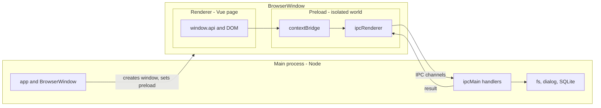
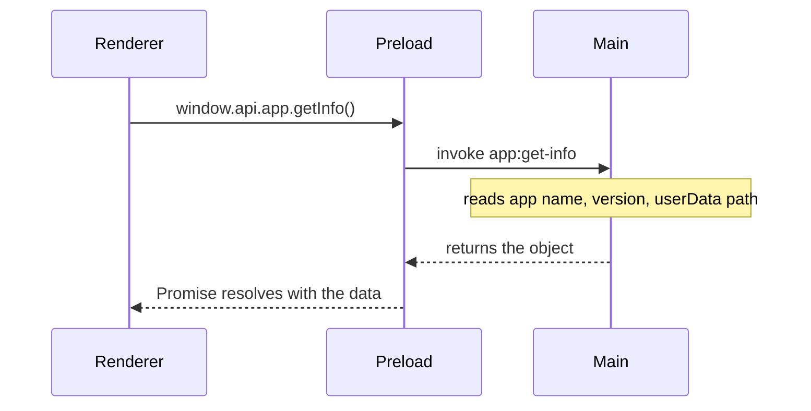
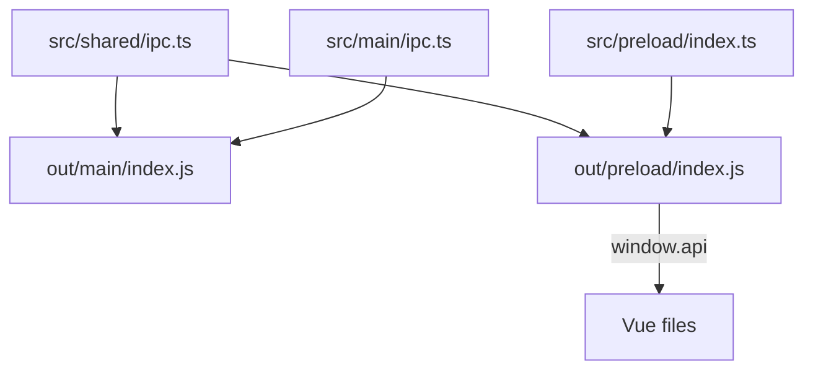

# How Electron's three processes work

If you have only built web apps before, the hardest thing about Electron is understanding that your application is not one program. It is three separate JavaScript runtimes that happen to work together. They do not share variables, they do not share memory, and they cannot call each other's functions directly. The only way they communicate is by sending messages back and forth -- and this template is built entirely around that pattern.

This document explains what those three runtimes are, what each one is allowed to do, and how a button click in Vue ends up reading a file from the user's hard drive.

## The three runtimes

### Main -- the backend that lives on the user's machine

When you double-click the app, the first thing that runs is a Node.js process. In a web app, your backend is a server on the internet. In Electron, the "backend" is a Node process running right here on the same computer. It can do everything Node can do: read files, open native dialogs, talk to SQLite, spawn child processes, and create windows.

In this project, the main process lives in `src/main/`. After electron-vite compiles it, the output goes to `out/main/index.js`.

The main process is responsible for:

- Creating the app window (the `BrowserWindow`).
- Opening and managing the SQLite database.
- Handling every IPC request that comes from the Vue side.
- Saving the window size and position.
- Checking for updates.
- Logging to files on disk.

You can think of main as "the operating system side of the app." It has full privileges. It is trusted.

### Renderer -- the Vue app inside the window

The main process creates a `BrowserWindow`, which is essentially a Chromium browser tab without the browser chrome. Inside that tab, a Vue app runs. It has a DOM, it can use CSS, it renders your entire UI. In development, it loads from a local Vite dev server (`http://localhost:5173`). In production, it loads from compiled HTML files on disk.

The renderer lives in `src/renderer/src/`. It has Vue Router, Pinia, Tailwind, shadcn-vue -- everything you would expect in a modern Vue project.

But here is the catch: **the renderer cannot do anything a normal website cannot do.** It has no access to `fs`, no access to `dialog`, no access to `app`, and no access to the database. Electron enforces this through a feature called **context isolation**. Even though the renderer is running inside Electron (not in Chrome), Electron deliberately hides all of its Node APIs from the page. This is a security measure. If the renderer could access Node, then any cross-site scripting vulnerability in your UI would give an attacker full access to the user's filesystem.

So the renderer is "untrusted." It can only do what the preload script explicitly allows.

### Preload -- the locked door between main and renderer

The preload script runs in the same window as the Vue app, but in a separate JavaScript world. It can see `ipcRenderer` (for sending messages to main) and `contextBridge` (for safely exposing things to the page). It cannot see `app`, `dialog`, `fs`, or any of the heavy-duty APIs that main has.

Its entire job is to define an object called `window.api` and make it available to Vue. That object is the only way the renderer can talk to the outside world.

In this project, the preload script lives in `src/preload/index.ts`. It defines methods like `window.api.db.getSetting()` and `window.api.dialog.open()`. Each of those methods does nothing more than call `ipcRenderer.invoke('some-channel', data)` and return the Promise.

You can think of preload as a locked door. Main is on one side with all the power. Vue is on the other side with just the UI. Preload decides which specific requests are allowed to pass through.

## A visual overview

| | Main | Preload | Renderer |
| --- | --- | --- | --- |
| What it is | A Node.js process | A script in the window's isolated world | A Chromium page |
| Source code | `src/main/` | `src/preload/` | `src/renderer/` |
| Compiled to | `out/main/index.js` | `out/preload/index.js` | Vite dev server or `out/renderer/` |
| Can use `app`, `BrowserWindow`, `dialog` | Yes | No | No |
| Can use `fs`, SQLite, electron-updater | Yes | No | No |
| Can use `ipcMain` | Yes | No | No |
| Can use `ipcRenderer` | No | Yes | No |
| Can use `contextBridge` | No | Yes | No |
| Can use `window.api` | No | It creates it | This is all it gets |
| Can use the DOM and Vue | No | No | Yes |
| Trust level | Fully trusted | Narrow bridge | Untrusted |

## How a message travels from Vue to main and back

Let's trace a real example. The About page in this app has a button that calls `window.api.app.getInfo()`. When you click it, here is what actually happens:

**Step 1.** Vue calls `window.api.app.getInfo()`. This is a normal function call. Vue does not know or care that it crosses a process boundary -- it just looks like calling an async function.

**Step 2.** That function was defined in the preload script. Its implementation is one line: `ipcRenderer.invoke('app:get-info')`. This sends a message to the main process on a channel called `app:get-info` and returns a Promise that will resolve when main replies.

**Step 3.** In the main process, there is a handler registered with `ipcMain.handle('app:get-info', ...)`. This handler runs `app.getName()`, `app.getVersion()`, and so on, and returns an object.

**Step 4.** Electron serializes that object, sends it back through the IPC channel, and the Promise in the preload script resolves. Vue gets the data.

The entire round trip happens in microseconds. From Vue's perspective, it is just an `await`.

### Three styles of IPC

Not every message needs a response. This project uses three patterns:

**Request and response** (`invoke` / `handle`). Vue sends a message and waits for an answer. This is used for anything that returns data: getting a setting, opening a file dialog, reading app info. In the preload script, the function calls `ipcRenderer.invoke()`. In main, the handler is registered with `ipcMain.handle()`.

**Fire and forget** (`send` / `on`). Vue sends a message and does not wait. This is used for things like minimize, maximize, and close -- the window just does it, there is nothing to return. In preload, the function calls `ipcRenderer.send()`. In main, the handler uses `ipcMain.on()`.

**Main pushes to Vue** (`webContents.send` / `ipcRenderer.on`). Sometimes the main process needs to tell Vue that something changed. For example, when the user double-clicks the title bar to maximize the window, main sends the new maximized state to the renderer. Main calls `mainWindow.webContents.send('window:maximized-changed', true)`. In the preload script, there is a listener using `ipcRenderer.on()` that calls a callback the Vue component provided.

## Where `src/shared` fits in

You may have noticed that both main and preload import from `src/shared/ipc.ts`. That file contains the channel names (like `'app:get-info'`) and Zod schemas that describe what data each channel expects.

An important detail: **`src/shared` does not exist as a file at runtime.** electron-vite is a bundler. When it compiles main, it copies the channel names into `out/main/index.js`. When it compiles preload, it copies them into `out/preload/index.js`. Each process gets its own copy of the same strings.

This is why channel names are defined in one place and imported everywhere. If you type the string `'app:get-info'` by hand in both main and preload, a typo in one of them will silently break the feature. By importing `IpcChannels.appGetInfo`, TypeScript catches the mistake at compile time.

## The mental model

Think of it this way:

- **Main** is the operating system side of the app. It has all the power.
- **Renderer** is the website inside the window. It has the UI.
- **Preload** is the locked door between them. Only the functions it explicitly publishes can cross the boundary.
- **Shared** is the label on that door. It tells both sides what channels exist and what shape the data takes.

To give Vue a new capability, you do not give Vue access to Node. You add a new handler on the main side, expose a new function on `window.api` through preload, and call it from Vue. The [Adding IPC handlers](README.md) guide walks through this process step by step.
